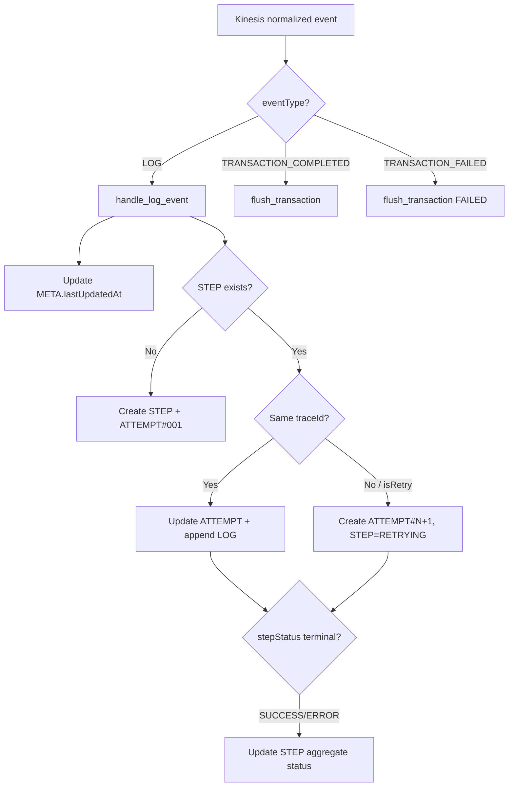

# LogStream — Retry & Attempt Design (Draft)

Tài liệu draft cho case **transaction có retry job async**, thời gian step không cố định, cần vẫn ghi nhận log qua pipeline hiện tại.

---

## Tóm tắt thay đổi

| Thành phần | Trước | Sau |
|---|---|---|
| Kết thúc transaction | Timeout cố định (GSI1) | **Idle timeout** + lifecycle event |
| 1 step = 1 traceId | Có (conflict retry) | **1 step = N attempts**, mỗi attempt 1 traceId |
| DynamoDB buffer | META + STEP + LOG | Thêm **ATTEMPT** item |
| PostgreSQL | `transaction_steps` only | Thêm **`step_attempts`** |
| STEP status | STARTED/SUCCESS/ERROR/... | Thêm **`RETRYING`** |

---

## Quy ước log từ microservice / retry job

### Attempt đầu (service gốc)

```json
{
  "transactionId": "TXN-001",
  "traceId": "trace-bbb",
  "step": "PAYMENT",
  "level": "ERROR",
  "message": "Payment declined",
  "errorCode": "PAYMENT_DECLINED",
  "stepStatus": "ERROR",
  "timestamp": "2026-06-09T10:00:03.500Z"
}
```

### Retry job (attempt 2)

```json
{
  "transactionId": "TXN-001",
  "traceId": "trace-retry-002",
  "step": "PAYMENT",
  "level": "INFO",
  "message": "Retry payment attempt 2",
  "stepStatus": "STARTED",
  "timestamp": "2026-06-09T10:05:00.000Z",
  "metadata": {
    "isRetry": true,
    "attempt": 2,
    "parentTraceId": "trace-bbb"
  }
}
```

### Heartbeat (retry chạy lâu, ít log)

```json
{
  "transactionId": "TXN-001",
  "traceId": "trace-retry-002",
  "step": "PAYMENT",
  "level": "DEBUG",
  "message": "Retry in progress",
  "metadata": { "isRetry": true, "attempt": 2, "heartbeat": true }
}
```

### Kết thúc transaction (bắt buộc để flush)

```json
{
  "eventType": "TRANSACTION_COMPLETED",
  "transactionId": "TXN-001",
  "timestamp": "2026-06-09T10:06:00.000Z"
}
```

Hoặc `TRANSACTION_FAILED` khi hết retry.

**Bắt buộc retry job:** luôn gửi `transactionId` (giữ nguyên), `traceId` mới mỗi attempt, `step` cùng tên step logic.

---

## DynamoDB — Item type `ATTEMPT`

```
PK:  TXN#TXN-001
SK:  ATTEMPT#<order>#<stepName>#<attemptPadded>   ← ATTEMPT#02#PAYMENT#002
```

| Attribute | Type | Mô tả |
|---|---|---|
| `stepName` | S | PAYMENT |
| `stepOrder` | N | 2 |
| `attemptNumber` | N | 1, 2, 3... |
| `traceId` | S | traceId của attempt này |
| `parentTraceId` | S \| null | traceId attempt trước (retry) |
| `isRetry` | BOOL | true nếu attempt > 1 hoặc metadata.isRetry |
| `status` | S | STARTED \| SUCCESS \| ERROR \| TIMEOUT \| SKIPPED |
| `serviceName` | S | retry-worker / payment-svc |
| `startedAt` | S | ISO 8601 |
| `endedAt` | S \| null | ISO 8601 |
| `durationMs` | N \| null | |
| `errorCode` | S \| null | |
| `errorMessage` | S \| null | |
| `logChunkCount` | N | Số chunk LOG buffer |
| `gsi2pk` | S | `TRACE#<traceId>` |
| `gsi2sk` | S | `TXN#<transactionId>` |

### Cấu trúc transaction có retry

```
TXN#TXN-001
├── META                          status=RUNNING, lastUpdatedAt reset mỗi log
├── STEP#02#PAYMENT               status=RETRYING, attemptCount=2, latestTraceId=trace-retry-002
├── ATTEMPT#02#PAYMENT#001        attempt 1, trace-bbb, ERROR
├── ATTEMPT#02#PAYMENT#002        attempt 2, trace-retry-002, STARTED
├── LOG#trace-bbb#0001
└── LOG#trace-retry-002#0001
```

### STEP item — thay đổi

- `traceId` → đổi tên thành **`latestTraceId`** (trace attempt cuối)
- Thêm **`attemptCount`**
- Status thêm **`RETRYING`**
- **Bỏ** `gsi2pk`/`gsi2sk` trên STEP (GSI2 chỉ trên ATTEMPT)

---

## Idle timeout (thay fixed timeout)

GSI1 vẫn dùng `STATUS#RUNNING` + `gsi1sk = lastUpdatedAt`, nhưng semantics đổi:

| | Fixed timeout | Idle timeout |
|---|---|---|
| Ý nghĩa | Transaction chạy quá 30s | **Không có log/event nào trong 30 phút** |
| Reset timer | Không | Mỗi LOG / heartbeat → `lastUpdatedAt = now()` |
| Retry dài | False positive TIMEOUT | An toàn nếu retry ghi log định kỳ |

```python
# Detection Engine — idle sweep (khuyến nghị default 30 phút)
IDLE_TIMEOUT_SECONDS = 30 * 60

threshold = now() - IDLE_TIMEOUT_SECONDS
query GSI1 where gsi1pk = 'STATUS#RUNNING' AND gsi1sk < threshold
# → đánh dấu TIMEOUT, emit TRANSACTION_ISSUE, optional flush
```

Timeout sweep **không** flush transaction đang chờ retry có `metadata.awaitingRetry = true` trên META (tùy chọn).

---

## Transaction Aggregator — luồng xử lý event



### Pseudocode `handle_log_event`

```
function handle_log_event(event):
    txn_id   = event.transactionId
    trace_id = event.traceId
    step     = event.stepName
    now      = iso_now()

    is_retry = event.metadata.isRetry OR event.metadata.attempt > 1
    attempt  = event.metadata.attempt OR null
    parent   = event.metadata.parentTraceId OR null

    # 1. Luôn reset idle timer
    update_meta(txn_id, lastUpdatedAt=now, gsi1sk=now, currentStep=step)

    # 2. Resolve STEP
    step_item = get_step(txn_id, step)
    if not step_item:
        step_order = next_step_order(txn_id)
        put_step(txn_id, step, order=step_order, status=STARTED, attemptCount=1)
        put_attempt(txn_id, step, attempt=1, trace_id, is_retry=false, status=STARTED)
    else:
        current_attempt = get_attempt_by_trace(txn_id, trace_id)
        if current_attempt:
            # Cùng attempt — append log, cập nhật status nếu có stepStatus
            merge_attempt_status(current_attempt, event.stepStatus)
        elif is_retry OR trace_id != step_item.latestTraceId:
            # Attempt mới (retry)
            n = step_item.attemptCount + 1
            attempt_num = attempt OR n
            put_attempt(txn_id, step, attempt=attempt_num, trace_id,
                        parent_trace_id=parent OR step_item.latestTraceId,
                        is_retry=true, status=STARTED)
            update_step(txn_id, step, status=RETRYING, attemptCount=attempt_num,
                        latestTraceId=trace_id)
        else:
            # Fallback: cùng step, trace lạ không đánh dấu retry → attempt mới
            ...

    # 3. Buffer log
    append_log_chunk(txn_id, trace_id, step, event)

    # 4. Cập nhật STEP aggregate nếu attempt terminal
    if event.stepStatus in (SUCCESS, ERROR, TIMEOUT, SKIPPED):
        update_step_from_latest_attempt(txn_id, step)
        if event.stepStatus == SUCCESS:
            update_step(txn_id, step, status=SUCCESS)
        elif not is_retry_pending(txn_id):
            update_step(txn_id, step, status=event.stepStatus)
```

### Flush → PostgreSQL + S3

```
function flush_transaction(txn_id, final_status):
    items = query_all PK=TXN#txn_id

    for each ATTEMPT item (group by stepName, sort by attemptNumber):
        logs = query LOG#<traceId>#*
        s3_key = write_s3(txn_id, traceId, logs)
        upsert step_attempts (...)

    for each STEP item:
        upsert transaction_steps (
            status, attempt_count, latest_trace_id,
            error_code from last failed attempt or success
        )

    upsert transactions (status=final_status, completed_at=now)
    batch_delete all items PK=TXN#txn_id
```

S3 path giữ nguyên: `.../transactionId=<id>/traceId=<traceId>/part-0001.jsonl.gz`

---

## Mapping DynamoDB → PostgreSQL (cập nhật)

| DynamoDB | PostgreSQL | S3 |
|---|---|---|
| `META` | `transactions` | — |
| `STEP#xx#name` | `transaction_steps` | — |
| `ATTEMPT#xx#name#nnn` | `step_attempts` | — |
| `LOG#traceId#nnn` | `step_attempts.s3_log_key` | `.../traceId/*.jsonl.gz` |

---

## Query API (gợi ý)

```sql
-- Flow diagram
SELECT step_order, step_name, status, attempt_count, latest_trace_id, error_code
FROM transaction_steps
WHERE transaction_id = $1
ORDER BY step_order;

-- Chi tiết attempts khi user click vào step PAYMENT
SELECT attempt_number, trace_id, is_retry, status,
       started_at, ended_at, s3_log_key, log_line_count
FROM step_attempts
WHERE transaction_id = $1 AND step_name = $2
ORDER BY attempt_number;
```

---

## File liên quan

| File | Mô tả |
|---|---|
| `schema/postgresql-retry-migration.sql` | Migration PostgreSQL |
| `schema/dynamodb.json` | Item type ATTEMPT (đã bổ sung) |
| `lambda/transaction-aggregator/` | Draft Lambda Aggregator |

---

## Checklist triển khai

- [ ] Chạy `postgresql-retry-migration.sql`
- [ ] Deploy Transaction Aggregator Lambda
- [ ] Cập nhật retry worker: format log + heartbeat
- [ ] Detection Engine: đổi fixed → idle timeout
- [ ] Query API: endpoint list attempts per step
- [ ] Emit `TRANSACTION_COMPLETED` / `TRANSACTION_FAILED` từ orchestrator
